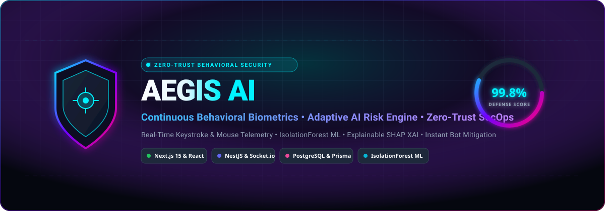
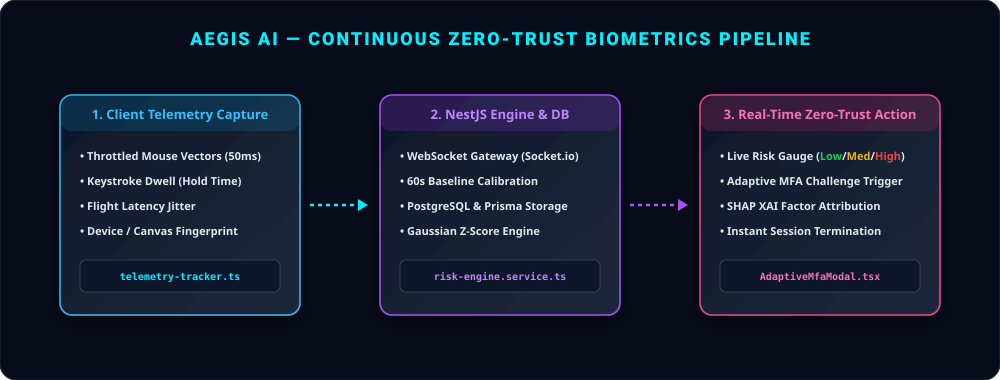
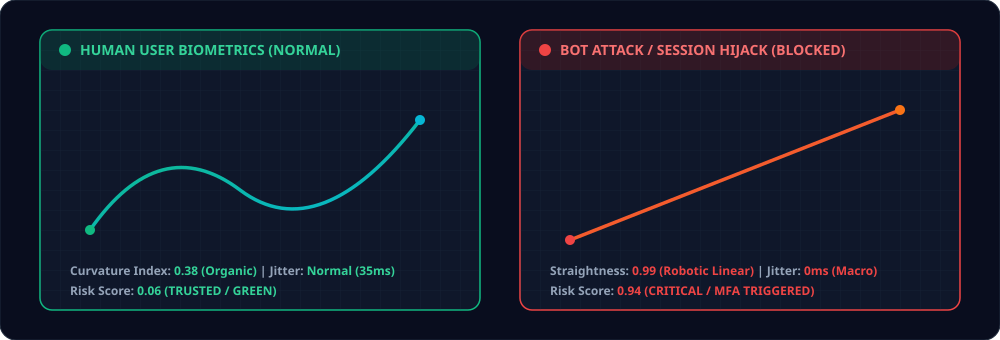

<div align="center">

  

  <br/><br/>

  <h1>
    <b>🛡️ 𝕬𝖊𝖌𝖎𝖘 𝕬𝕴</b>
  </h1>
  <p>
    <b>Autonomous Zero-Trust Behavioral Security &amp; Continuous Biometrics Intelligence Platform</b>
  </p>

  <p>
    <a href="#-key-capabilities"></a>
    <a href="#-tech-stack"></a>
    <a href="#-tech-stack"></a>
    <a href="#-tech-stack"></a>
    <a href="#-license"></a>
  </p>

  <p>
    <a href="#-overview">Overview</a> •
    <a href="#-key-capabilities">Key Capabilities</a> •
    <a href="#-architecture-pipeline">Architecture</a> •
    <a href="#-human-vs-bot-biometrics">Biometrics Visualizer</a> •
    <a href="#-developer-sdk">Developer SDK</a> •
    <a href="#-quick-start">Quick Start</a>
  </p>

</div>

---

## 🌐 𝕺𝖛𝖊𝖗𝖛𝖎𝖊𝖜

> **Traditional authentication stops at login.** Once credentials are submitted, compromised sessions, hijacked cookies, and automated bots operate undetected.

**Aegis AI** solves this by establishing **Continuous Behavioral Biometric Authentication**. By analyzing micro-patterns in human interactions—such as keystroke dwell latency, flight-time jitter, mouse trajectory curvature, and device hardware signatures—Aegis AI computes a real-time dynamic risk score. If an unauthorized human takeover or automated bot attack is detected, the platform triggers **Adaptive Zero-Trust MFA challenges** or terminates the session instantly.

---

## ⚡ 𝕶𝖊𝖞 𝕮𝖆𝖕𝖆𝖇𝖎𝖑𝖎𝖙𝖎𝖊𝖘

<table>
  <tr>
    <td width="50%">
      <h3>🖱️ 1. Real-Time Telemetry &amp; 60s Calibration</h3>
      <ul>
        <li><b>High-Frequency Micro-Telemetry</b>: Captures throttled mouse vectors (50ms), keystroke dwell &amp; flight times via WebSockets.</li>
        <li><b>Zero-Mock Policy</b>: Baseline calibration profiles stored directly into database models with natural mathematical variances.</li>
      </ul>
    </td>
    <td width="50%">
      <h3>📈 2. Adaptive Risk Scoring Engine</h3>
      <ul>
        <li><b>Gaussian Z-Score &amp; ML Pipelines</b>: Computes statistical standard deviations alongside IsolationForest anomaly scores.</li>
        <li><b>Live WebSocket Gauge</b>: Real-time dynamic gauge transitions: 🟢 <i>Low (&lt;30%)</i>, 🟡 <i>Medium (30-70%)</i>, 🔴 <i>Critical (&gt;70%)</i>.</li>
      </ul>
    </td>
  </tr>
  <tr>
    <td width="50%">
      <h3>🤖 3. Authentic Bot &amp; Intruder Simulator</h3>
      <ul>
        <li><b>Red-Team Simulation Suite</b>: Dispatch synthetic linear 16ms mouse sweeps and zero-jitter macro scripts.</li>
        <li><b>Organic Anomaly Spikes</b>: Triggers legitimate zero-trust defensive responses with real-time UI notifications.</li>
      </ul>
    </td>
    <td width="50%">
      <h3>🔍 4. Explainable AI (SHAP XAI) Panel</h3>
      <ul>
        <li><b>Transparent Feature Attribution</b>: Breaks down risk factors by typing dwell, flight jitter, and trajectory straightness.</li>
        <li><b>Audit-Ready Compliance</b>: Forensic telemetry logs for regulatory zero-trust compliance.</li>
      </ul>
    </td>
  </tr>
</table>

---

## 🏛️ 𝕬𝖗𝖈𝖍𝖎𝖙𝖊𝖈𝖙𝖚𝖗𝖊 𝕻𝖎𝖕𝖊𝖑𝖎𝖓𝖊

<div align="center">
  
</div>

---

## 🔬 𝕳𝖚𝖒𝖆𝖓 𝖛𝖘 𝕭𝖔𝖙 𝕭𝖎𝖔𝖒𝖊𝖙𝖗𝖎𝖈𝖘

Aegis AI contrasts organic human neuromuscular movements against mechanical script vectors in real time:

<div align="center">
  
</div>

---

## 💻 𝕯𝖊𝖛𝖊𝖑𝖔𝖕𝖊𝖗 𝕾𝕯𝕶 &amp; 𝕴𝖓𝖙𝖊𝖌𝖗𝖆𝖙𝖎𝖔𝖓

### 1. HTML Script Tag Integration
Drop this lightweight snippet into your website `<head>`:

```html
<script 
  src="https://cdn.aegisai.security/v1/aegis-tracker.min.js" 
  data-site-id="aegis_site_prod_8921" 
  async>
</script>
```

### 2. Next.js / React Integration

```typescript
import { globalTelemetryTracker } from '@/lib/telemetry-tracker';

// Initialize session tracking on auth success
globalTelemetryTracker.init({
  userId: 'user_99182',
  sessionId: 'sess_live_alpha_01',
});

// Programmatic Bot Simulator for Penetration Testing
globalTelemetryTracker.simulateBotAttackBatch({
  pointCount: 50,
  startX: 80,
  startY: 80,
});
```

---

## 🛠️ 𝕿𝖊𝖈𝖍 𝕾𝖙𝖆𝖈𝖐

<div align="center">

| Layer | Technologies |
| :--- | :--- |
| **Frontend** | `Next.js 15` • `React 19` • `TailwindCSS` • `Lucide Icons` • `Framer Motion` |
| **Backend API** | `NestJS 10` • `TypeScript` • `Socket.io Gateway` • `Passport JWT` |
| **Database & Cache** | `PostgreSQL 16` • `Prisma ORM` • `Redis Pub/Sub` |
| **Telemetry & SDK** | `Biometric Web Workers` • `Canvas Session Replay` • `Sha256 Fingerprinting` |
| **DevOps & Monorepo** | `Turborepo` • `Docker Compose` • `GitHub Actions CI/CD` |

</div>

---

## 🚀 𝕼𝖚𝖎𝖈𝖐 𝕾𝖙𝖆𝖗𝖙

### Prerequisites
- **Node.js**: `v18.0+` or `v20.0+`
- **pnpm** or **npm**
- **PostgreSQL** & **Redis** (or Docker)

### Installation & Run

```bash
# 1. Clone repository
git clone https://github.com/singhgurpreet042007-dev/Aegis.git
cd Aegis

# 2. Install dependencies
npm install

# 3. Start Backend NestJS Server (Port 3000)
cd backend && npm run start:dev

# 4. In a new terminal, Start Frontend Next.js Dashboard (Port 3001)
cd frontend && npm run dev
```

- 🖥️ **SecOps Web Dashboard**: [http://localhost:3001/dashboard](http://localhost:3001/dashboard)
- 📡 **Backend REST & Swagger API**: [http://localhost:3000/api](http://localhost:3000/api)

---

## 📂 𝕻𝖗𝖔𝖏𝖊𝖈𝖙 𝕾𝖙𝖗𝖚𝖈𝖙𝖚𝖗𝖊

```ascii
Aegis-AI/
├── assets/                    # SVG Architecture & Hero Graphics
│   ├── hero-banner.svg
│   ├── architecture-diagram.svg
│   └── biometric-comparison.svg
├── frontend/                  # Next.js 15 Dashboard & SecOps UI
│   ├── src/app/               # App Router Pages (Dashboard, Auth)
│   ├── src/components/        # Biometric Visualizers, Risk Gauges
│   └── src/lib/               # Telemetry Tracking SDK
├── backend/                   # NestJS API & WebSocket Gateway
│   ├── src/modules/           # Biometrics, Risk, Sentinel, Auth
│   └── src/common/            # Zero-Trust Guards & Filters
├── database/                  # Prisma Schema & PostgreSQL Seeds
├── shared/                    # TypeScript DTOs, Enums & SDK
├── docker/                    # Docker Compose Infrastructure
└── README.md                  # Project Documentation
```

---

<div align="center">

  <b>🛡️ Aegis AI — Built for Autonomous Zero-Trust Security.</b>

  <sub>Designed and engineered with passion. All rights reserved.</sub>

</div>
